# Realization of Bell's theorem certified quantum random number generation using cloud quantum computers

This repository is a collection of DoraHack's experiments for certified quantum random number generation using cloud quantum computers. 

* [Realization of Bell's theorem certified quantum random number generation using cloud quantum computers](#realization-of-bells-theorem-certified-quantum-random-number-generation-using-cloud-quantum-computers)
    * [Random number applications](#random-number-applications)
    * [Classifications of random number generation](#classifications-of-random-number-generation)
    * [DI-QRNG and Bell's theorem](#di-qrng-and-bells-theorem)
    * [Workflow of DI-QRNG](#workflow-of-di-qrng)
    * [Randomness extraction and assessment](#randomness-extraction-and-assessment)
    * [Experimental realization on cloud quantum computers](#experimental-realization-on-cloud-quantum-computers)
        * [Clauser-Horne-ShimonyHolt (CHSH) game](#clauser-horne-shimonyholt-chsh-game)
        * [Quantum circuits](#quantum-circuits)
        * [Results](#results)
        * [Conclusion](#conclusion)
        * [Discussion](#discussion)
        * [Problems](#problems)
    * [References](#references)
    * [Appendix A](#appendix-a)
        * [PRNG NIST test](#prng-nist-test)
        * [QRNG NIST test](#qrng-nist-test)

<!--## Glossary

This introduction aims at broad audience with different scientific backgrouds. To make it more intelligible, we list the necessary glossary, including terms and abbreviations.

| **Term** | **Definition** |
| -------- | -------- |
| PRNG     | Pseudo Random Number Generator     |
| QRNG | Quantum Random Number Generator |
|DI-QRNG| Device-independent Random Number generator|
|VRF|Verifiable Random Function|-->

## Random number applications

Randomness refers to the quality of being unpredictable or haphazard. It is an essential concept in various fields, ranging from computer science to statistical analysis. In today's world, randomness plays a crucial role in many applications across different scenarios. 

For example, in cryptography, random numbers are used to generate secure keys and passwords that are difficult to crack. In gaming, random numbers are used to create unpredictable outcomes and add an element of chance, making the experience more exciting and engaging for users. In scientific simulations, random numbers are used to model complex systems and generate experimental data that accurately reflects real-world conditions. By using random numbers as inputs, scientists can test hypotheses and gain insights into the behavior of physical phenomena such as weather patterns or biological processes. In statistics, random numbers are used to create representative samples, which are subsets of larger populations that are used to make inferences about the population as a whole. This is important in fields such as public health, where researchers need to understand how certain diseases affect different segments of the population. By gathering data from randomly selected individuals, researchers can obtain a clearer picture of the disease's prevalence and its impact on various demographic groups.

## Classifications of random number generation

Generally, there are two ways to produce the random numbers: PRNG (Pseudo random number generator) and QRNG (quantum random number generator). 

Pseudo random number generators (PRNGs) are algorithms that generate sequences of numbers that appear to be random but are actually deterministic, meaning that the output is entirely dependent on the algorithm and a seed value. Examples of PRNGs include linear congruential generators (LCGs) and Mersenne Twister, which is the default algorithms in MATLAB, Mathematica and Python. In contrast, quantum random number generators (QRNGs) use quantum mechanical processes to generate truly random numbers. Examples of QRNGs include devices that measure vacuum fluctuations or phase fluctuations of amplified spoteneous emission. Recently, utilizing integrated balanced homodyne detector, the QRNG of 100Gbit/s is demonstrated [1].

While both PRNGs and QRNGs can be used for applications that require randomness, QRNGs have several advantages over PRNGs. First and foremost, QRNGs produce truly unpredictable numbers that cannot be reproduced, whereas PRNGs produce numbers that could potentially be predicted or hacked. This makes QRNGs particularly useful in fields such as cryptography and security, where high-quality randomness is essential to prevent attacks. Additionally, QRNGs are not subject to the same biases or weaknesses that can arise in PRNGs due to flaws in their algorithms or implementation. Finally, as quantum computing continues to advance, QRNGs are likely to become even more powerful and versatile tools for generating randomness.

## DI-QRNG and Bell's theorem

Device-independent quantum random number generation (DI-QRNG) is a groundbreaking approach to generating truly random numbers using the principles of quantum mechanics. Unlike traditional methods of generating random numbers, which rely on deterministic algorithms or physical processes, DI-QRNG uses the inherent randomness of entangled quantum systems to produce unpredictable and independent numbers that are not influenced by any particular experimental setup or device.

The key idea behind DI-QRNG is Bell's theorem, which states that any physical theory that obeys locality and realism (i.e., that assumes objects have definite properties when they are not being observed) must obey certain inequalities that can be violated by quantum mechanics. This violation implies that there is no local hidden variable theory that can fully explain the correlations between entangled quantum particles, and that their outcomes must be fundamentally unpredictable and random. In 2022, the Nobel Prize in Physics 2022 was awarded jointly to Alain Aspect, John F. Clauser and Anton Zeilinger "for experiments with entangled photons, establishing the violation of Bell inequalities and pioneering quantum information science". By using these measurements to generate random bits, DI-QRNG ensures that the generated numbers are completely independent of the measurement devices used to obtain them.

One of the main advantages of DI-QRNG over other methods of generating random numbers is its high level of security. Because the numbers are generated based on the fundamental laws of physics rather than on any specific algorithm, it is virtually impossible for an attacker to predict or manipulate the output. This makes DI-QRNG particularly useful in applications such as cryptography, where high-quality randomness is essential for maintaining the security of sensitive data.

Another advantage of DI-QRNG is that it does not require any assumptions about the properties of measurement devices, making it more robust against attacks that exploit vulnerabilities in hardware or software. In contrast, traditional QRNGs may be susceptible to flaws in the design or implementation of the physical systems used to generate random numbers. With DI-QRNG, however, the security of the generated random numbers is guaranteed by the laws of quantum mechanics themselves, making it a promising tool for a wide range of applications.

## Workflow of DI-QRNG

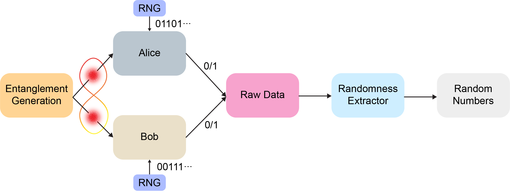

## Randomness extraction and assessment

In information sicence, entropy is a metric that quantifies the level of randomness within a system, or conversely, the amount of information that can be obtained from it. 

The Shannon entropy, also referred to as a basic measure of randomness, provides an estimate of this quantity by indicating the average amount of information (in bits) that can be extracted or acquired from the system. Let $X$ be a random variable obeying the probability distribution $P(x)$, the Shannon entropy is defined as 

$$H(X)=-\sum_{x\in\chi}P(x)\log_2P(x)$$
in which, $\chi$ denotes the set of all possible values of $x$. However, the Shannon entropy is actually a upper bound to evaluate the randomness. 

The lower bound of entropy is determined by the min-entropy $H_\infty(X)$, which is defined as 

$$H_\infty(X)=-\log_2\left[\max_{x\in\chi}P(x)\right]$$

Knowing the amount of randomness, in realistic QRNG device, it's necessary to distill the true randomness from classical noise. An extractor is a mapping function from $\lbrace0,1\rbrace^n\times\lbrace0,1\rbrace^d\rightarrow\lbrace0,1\rbrace^m$, such that for every probability distribution $X$ on $\lbrace0,1\rbrace^n$ with $H_\infty(X)\ge k$, the probability function $\text{Ext}(X,U_d)$ is $\varepsilon$-close to the uniform distribution $\lbrace0,1\rbrace^m$. The $U_d$ represents a uniform distribution on $\lbrace0,1\rbrace^d$, and $\varepsilon$-close is an error parameter of similarity of different distributions.

In applications, the Toeplitz matrices are commonly used to extract the random numbers from raw outputs. According to [Leftover Hash Lemma](https://dl.acm.org/doi/10.1145/73007.73009), the Toeplitz-hashing extractor is a strong extractor, that is, the random seed $U_d$ can be reused for subsequent applications.

After randomness extract, [NIST testing suite](https://csrc.nist.gov/projects/random-bit-generation/documentation-and-software) is used to assess the quality of random numbers. See the [Appendix A](#appendix-a) for the comparison between PRNG (produced by the NIST software) and QRNG (taken from the [public data](https://www.dropbox.com/sh/hae9ht1cc426i5g/AABcuGgGyuNJMC0zOxIhOQBGa?dl=0) of [2].

## Experimental realization on cloud quantum computers

In this section, we explain the experimental details and results to generate quantum random numbers, which are certified by Bell's theorem, using publicly cloud quantum computers.

### Clauser-Horne-ShimonyHolt (CHSH) game

CHSH game was proposed in paper [3], in which an inequality is used to discriminate the quantum mechanics from the local hidden-variable theories. Here, we empoly the same game settings as the paper [4]. In every trial, a Bell state is generated and distributed to two players, named Alice and Bob. The two players randomly select their measurements basis as $a_i\in\{0,1\}$ and $b_i\in\{0,1\}$. Then, the measurement outputs is denotes as $x_i, y_i$. The Bell value in single trial $i$ is calculated as

$$J_i=\begin{cases}
1,&\text{if}\quad x_i\bigoplus y_i=a_ib_i \\
0,&\text{others}
\end{cases}$$

and the CHSH game value is an average of $J_i$ for all trials, as

$$J=\sum_{i=1}^nJ_i-\frac34$$

here, $3/4$ is the classical threshold.

### Quantum circuits

To achieve the device-independent, a Bell state is necessary, which can be created by a `Hadamard gate` for qubit $0$ and a `controlled-not (CNOT) gate` between qubit $0$ and qubit $1$. Then, Alice and Bob perform independent and random measurements on their own qubit. For Alice, her measurements have two possible settings: $\sigma_z$ and $\sigma_x$, which are [Pauli matrices](https://en.wikipedia.org/wiki/Pauli_matrices). Similarly, for Bob his settings are: $\frac{1}{\sqrt{2}}\left(\sigma_z+\sigma_x\right)$ and $\frac{1}{\sqrt{2}}\left(\sigma_z-\sigma_x\right)$. Thus, there are four possible quantum circuits, and we summarize here (using [Qiskit](https://qiskit.org/))

| Quantum Circuits | Qiskit plot |
| ---------------- | ----------- |
| $(a_i, b_i) = (0, 0)$ |  |
| $(a_i, b_i) = (0, 1)$ | 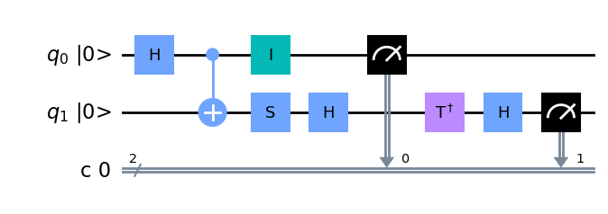 |
| $(a_i, b_i) = (1, 0)$ | 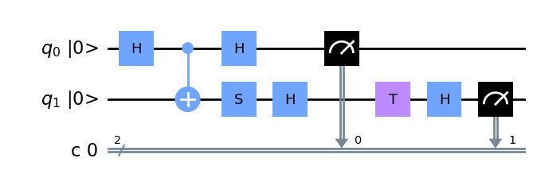 |
| $(a_i, b_i) = (1, 1)$ |  |

### Results

**STEP 1: Entanglement generation and characterization**

In our experiment, we use the Regetti [Aspen-M-3](https://qcs.rigetti.com/qpus) quantum computer from AWS Braket service. This superconducting chip features 79 qubits, and the median $T_1$ time is $22.1\ \mu s$, single-qubit gate fidelity of $99.7$%, two-qubit gate fidelity of $93.6$%.

First, we use quantum tomography [5] to reconstruct the denstiy matrix of Bell state (see [`Regetti_Tomography_pub.ipynb`](./Regetti_Tomography_pub.ipynb) and [`DM_reconstruction_regetti.ipynb`](./DM_reconstruction_regetti.ipynb)), as the following shows:

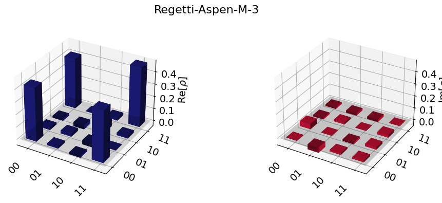

The fidelity can be calculated as $86.87$%, which is larger than the classical threshold of $50$%. And the non-zero values of anti-diagonal elements are direct evidence for the entanglement.

**STEP 2: CHSH game**

Then, we perform the CHSH game with `shots = 1E5` for every setting (see [`Regetti_CHSH_pub.ipynb`](./Regetti_CHSH_pub.ipynb)) and get the results as the following table shows:

| Basis Setting | $(a_i, b_i) = (0, 0)$ | $(a_i, b_i) = (0, 1)$ | $(a_i, b_i) = (1, 0)$ |$(a_i, b_i) = (1, 1)$|
|:-:|:-:|:-:|:-:|:-:|
|$(x_i, y_i) = (0, 0)$|41998|7712|8590|41700|
|$(x_i, y_i) = (0, 1)$|36513|12554|7498|43435|
|$(x_i, y_i) = (1, 0)$|41091|12469|9505|36935|
|$(x_i, y_i) = (1, 1)$|9583|44280|35503|10634|

The CHSH score can be calculated as $0.8036$, which is significantly larger than $0.75$, indicating the quantum correlation does exist during the experiments.

**STEP 3: Determine min-entropy and randomness extraction**

To determine the min-entropy value, we compare the criteria in paper [6] (see [`Nature2010.ipynb`](./Nature2010.ipynb) and [`Nature2010.txt`](./Nature2010.txt)) and paper [4] (see [`PRL2018.ipynb`](./PRL2018.ipynb) and [`PRL2018.txt`](./PRL2018.txt)), as the following picture shows:

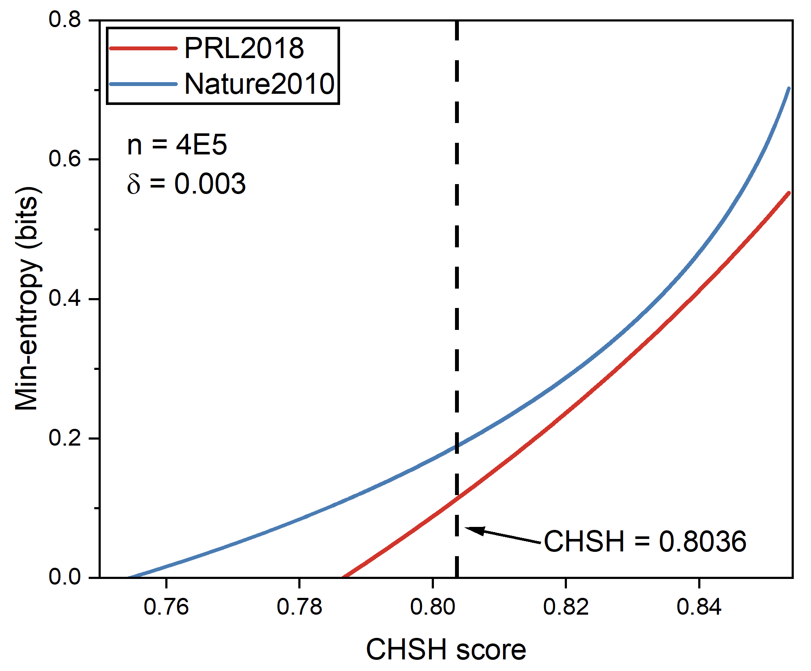

So, we choose the min-entropy calculation in paper [6], and the min-entropy is $0.186$ for our experimental parameters. We also note that for different parameters, the relationship of min-entropy between paper [6] and paper [4] is different. When trial number is larger, the calculation in paper [4] can obtain larger min-entropy. 

Finally, we use the Toeplitz-hashing extractor to extract the ultimate random numbers, see [`Randomness_extraction.ipynb`](./Randomness_extraction.ipynb). As a result, we obtain $74305$ random numbers.

**STEP 4: NIST test for the output of random numbers**

To characterize the randomness, we use the NIST test suite for our random number and the result is summarized as:

| Statistical tests | P value | Result |
|:-:|:-:|:-:|
|Frequency|0.193146|Success|
|BlockFrequency|0.646496|Success|
|CumulativeSums|0.294998|Success|
|Runs|0.855048|Success|
|LongestRun|0.903532|Success|
|Rank|0.621005|Success|
|FFT|0.919390|Success|
|NonOverlappingTemplate|0.601024|Success|
|OverlappingTemplate|0.696979|Success|
|ApproximateEntropy|0.265845|Success|
|Serial|0.304860|Success|
|LinearComplexity|0.925104|Success|

### Conclusion

In summary, we demonstrate the realization of Bell's theorem certified quantum random number generation using cloud quantum computers. Based on that the entanglement fidelity of Bell state is $86.87$% and the CHSH game score is $0.8036$, we extract more than $70000$ real random number and pass the NIST test to prove the randomness. In the future, we expect better CHSH score to improve the min-entropy value and we also prospect that randomness expansion is possible using superconducting quantum computer. Besides, we also note that the quantum advantages can also be used to achieve certified quantum random number generation [7].

### Discussion

Apart from the Regetti Aspen-M-3, we also benchmark the [Aria-1](https://ionq.com/quantum-systems/aria) from ionQ. Aria-1 has 25 qubits and its single-qubit gate fidelity is $99.94$% and two-qubit gate fidelity is $99.4$%. 

The density matrix of Bell state (see [`IonQ_Tomography_pub.ipynb`](./IonQ_Tomography_pub.ipynb) and [`DM_reconstruction_ionQ.ipynb`](./DM_reconstruction_ionQ.ipynb)) is:

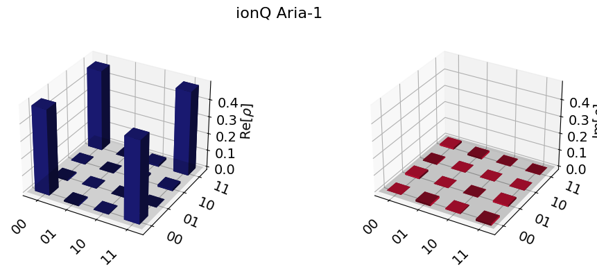

The calculated fidelity is $96.99$%, and it's higher than the Aspen-M-3.

We also perform CHSH game using Aria-1, and the score is $0.8362$ (see [`IonQ_CHSH_pub.ipynb`](./IonQ_CHSH_pub.ipynb)). From these values, we can deduce the min-entropy is $0.424$, when the experiment trial number is 1E5 for every setting. This min-entropy is more than twice as large as Aspen-M-3.

But, we want to point out the different costs for Aria-1 and Aspen-M-3. From AWS Braket service, for Aria-1, single shot needs $0.03$ USD, but for Aspen-M-3, single shot only needs $0.00035$ USD. So, it's much more expensive to achieve randomness expansion using Aria-1 in the future.

### Problems

**Problem 1: Entanglement fidelity and CHSH score are not stable for Regetti quantum computer**

Although in previous section, the entanglement fidelity is $86.87$% and the CHSH score is $0.8036$, which definitely prove the quantum computer is "quantum". But actually, in some accesses to Regetti, we obtain near entanglement-free result. Here, we give an example:

The density matrix is:

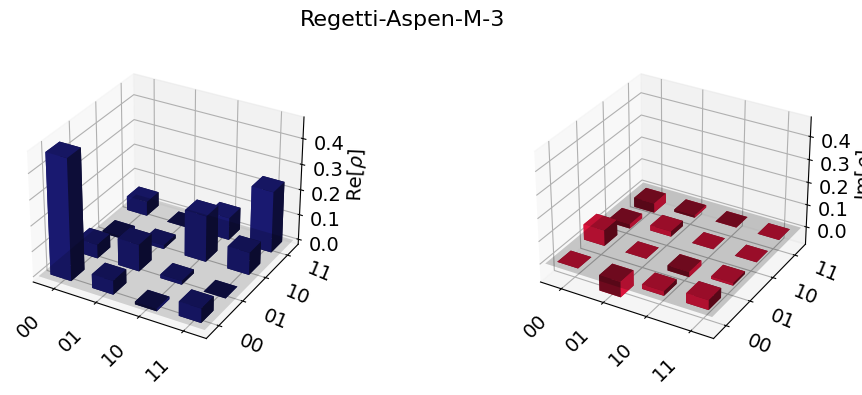

It's obvious that the anti-diagonal elements are near varnishing, which means it's more like classical state.

## References

[1] Bruynsteen, Cédric, et al. "100-Gbit/s integrated quantum random number generator based on vacuum fluctuations." PRX Quantum 4.1 (2023): 010330.

[2] Liu, Wen-Zhao, et al. "Device-independent randomness expansion against quantum side information." Nature Physics 17.4 (2021): 448-451.

[3] Clauser, John F., et al. "Proposed experiment to test local hidden-variable theories." Physical review letters 23.15 (1969): 880.

[4] Liu, Yang, et al. "High-speed device-independent quantum random number generation without a detection loophole." Physical review letters 120.1 (2018): 010503.

[5] James, Daniel FV, et al. "Measurement of qubits." Physical Review A 64.5 (2001): 052312.

[6] Pironio, Stefano, et al. "Random numbers certified by Bell’s theorem." Nature 464.7291 (2010): 1021-1024.

[7] Morvan, A., et al. "Phase transition in Random Circuit Sampling." arXiv preprint arXiv:2304.11119 (2023).

<!--## Comparison between QRNG and VRF-->

## Appendix A
 

### PRNG NIST test
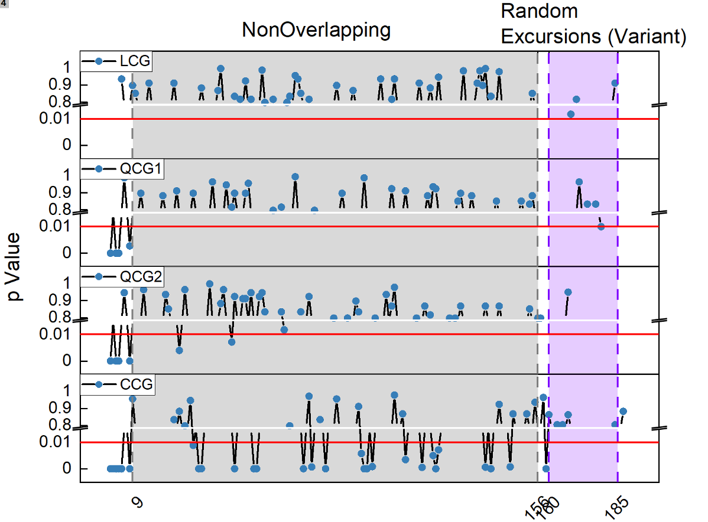
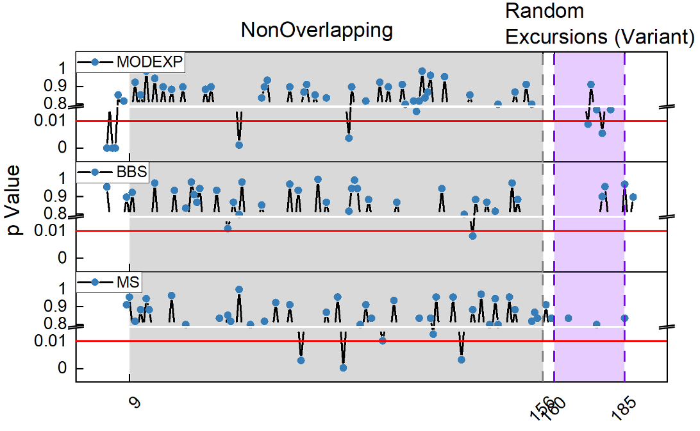

### QRNG NIST test
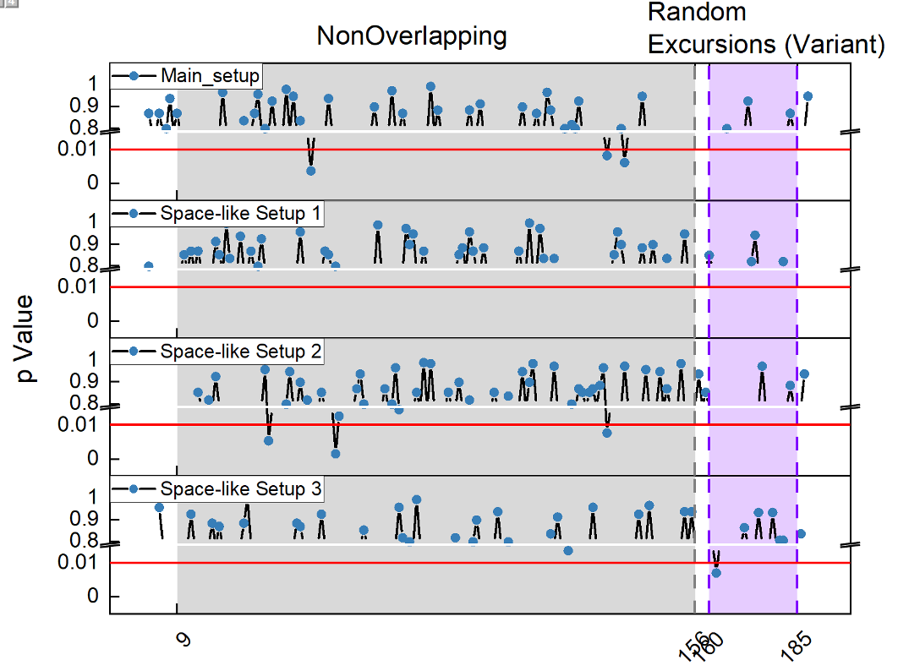
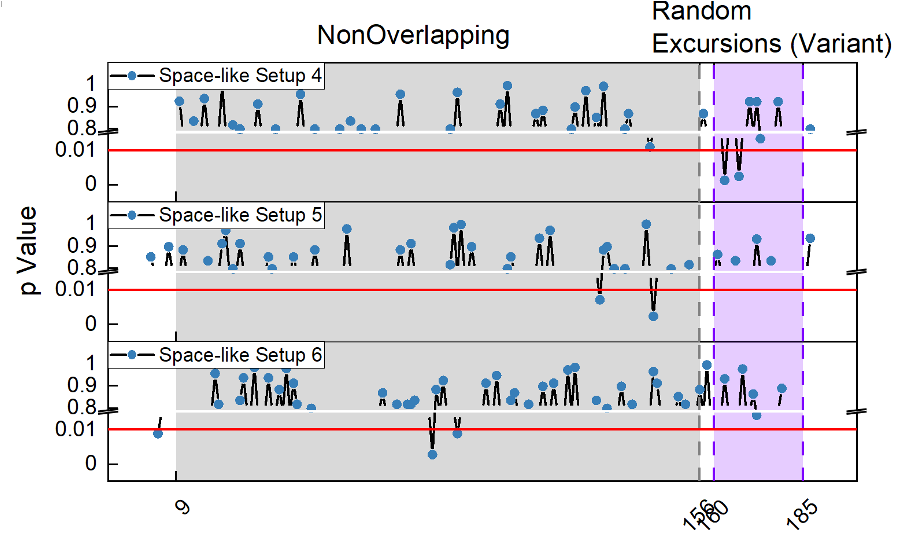

